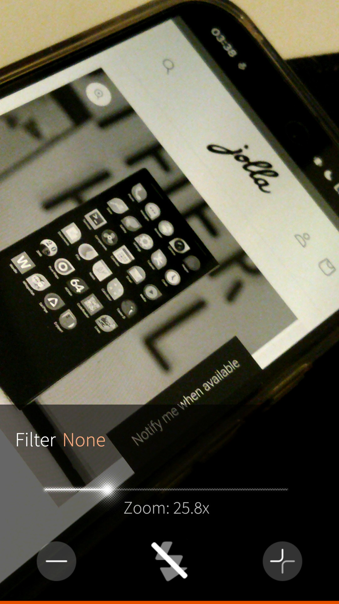
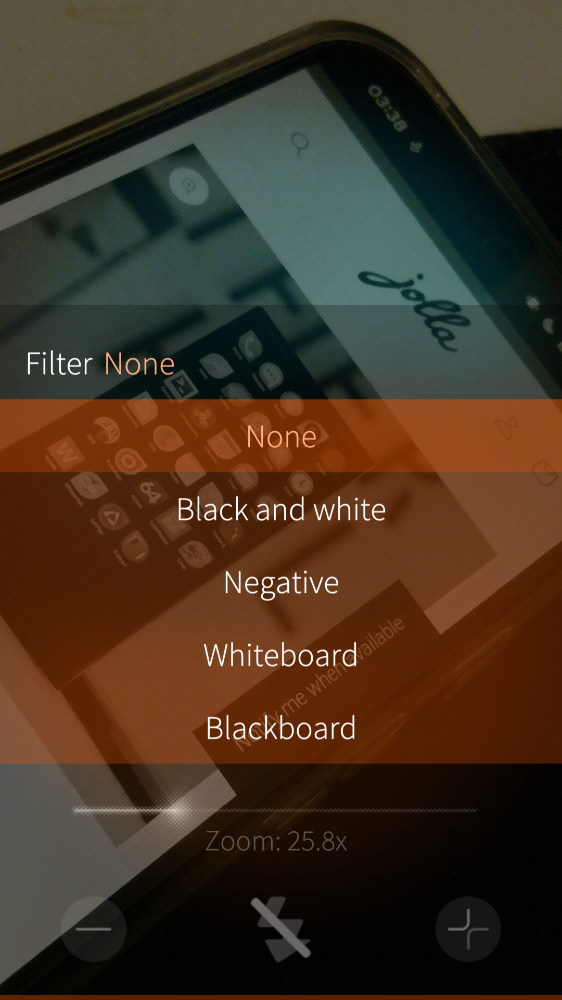

# Tarkka
Turn your Sailfish device into a digital magnifying glass. Designed for simplicity and accessibility.

## Features
 
 

* Smooth digital zoom up to 4x.
* Specialized filters: Negative, Grayscale, Whiteboard, and Blackboard.
* Torch support for low-light environments.
* Minimalist UI optimized for one-handed use.

## Support
If you like my work and want to buy me a beer, [feel free to do it](https://www.paypal.me/fravaccaro)!

## Translate
Request a new language or contribute to existing languages on the [Transifex project page](https://app.transifex.com/fravaccaro/tarkka/harbour-tarkkats/).

## Credits
Thanks to piggz and his amazing work on [Advancd Camera](https://github.com/piggz/harbour-advanced-camera), exposing the filter logic helped me immensely.

